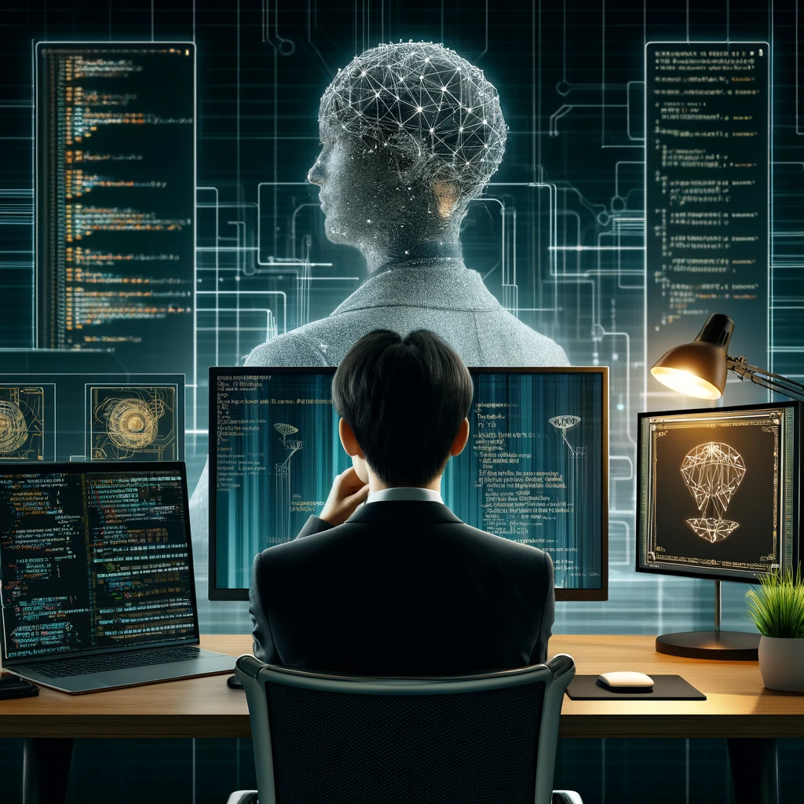

  <h3>I'm Baek. I build scalable AI & Computer Vision solutions</h3>
  <!---  --->

---

## Projects
I have worked on impactful projects that combine advanced AI with practical applications:
- [**AI Video Call Application**](https://baekcheolkim.github.io/docs/2portfolio/2video-call-AI-application-project.html):  
  A multi-channel video communication platform enhanced with **emotion detection** and **diarization prompts**.  
  This project leverages **GPT-powered NLP models** and **cloud-based scalability** with MLOps pipelines.

- [**Privacy-Aware Perception System for Robotics**](https://baekcheolkim.github.io/docs/2portfolio/3Privacy-Aware-Perception-System-for-Robotics.html):
  We propose an **End-to-End Human-Head Localisation via Body-Only Detection** model

---

## Education & Learning
- **M.Machine Learning & Computer Vision**, ANU (2023–2025)  
- **Key Coursework:** Machine Learning, Robotics, Deep Learning for CV  
---
<!---
---

## 📊 GitHub Stats

  
  
  

---
--->

## Resume

You can view or download my full resume [here](https://drive.google.com/file/d/1ml3fFEnWo2E8A6e2-dM_LiHaZ-RHzF7c/view?usp=drive_link).
